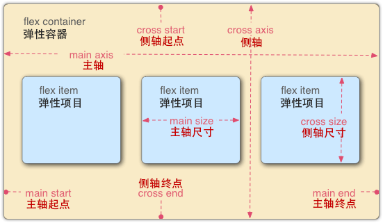

## 弹性盒子

### `flex`
> 参考：[Flex 布局教程：语法篇](http://www.ruanyifeng.com/blog/2015/07/flex-grammar.html)、[Flex 布局教程：实例篇](http://www.ruanyifeng.com/blog/2015/07/flex-examples.html)。

>1. 主轴：main axis。
>2. 侧轴（交叉轴）：cross axis。

1. Flex容器：设置为`display: flex;`或`display: inline-flex;`的元素。

    1. `flex-direction`：决定主轴的方向。
    
        1. `row`（默认）：水平方向，起点在左端。
        2. `row-reverse`：水平方向，起点在右端。
        3. `column`：垂直方向，起点在上沿。
        4. `column-reverse`：垂直方向，起点在下沿。
    2. `flex-wrap`：如果一条主轴排不下，如何换行。
        
        1. `nowrap`（默认）：不换行。
        2. `wrap`：换行，第一行在上方。
        3. `wrap-reverse`：换行，第一行在下方。
    3. `flex-flow`：`flex-direction`（可选）、`flex-wrap`（可选）的简写形式。
    4. `justify-content`：项目在主轴上的对齐方式（与轴的方向有关）。
    
        >假设主轴的方向为从左到右，起点就是左、终点就是右。
        
        1. `flex-start`（默认）：起点对齐。
        2. `flex-end`：终点对齐。
        3. `center`：居中。
        4. `space-between`：两端对齐，项目之间的间隔都相等。
        5. `space-around`：每个项目两侧的间隔相等。所以，项目之间的间隔比项目与边框的间隔大一倍。
    5. `align-items`：项目在侧轴上的对齐方式（与轴的方向有关）。
    
        >假设侧轴的方向为从上到下，起点就是上、终点就是下。
        
        1. `stretch`（默认）：如果项目未设置高度或设为auto，将占满整个容器的高度。
        2. `flex-start`：起点对齐。
        3. `flex-end`：终点对齐。
        4. `center`：居中。
        5. `baseline`：项目的第一行文字的基线对齐。
    6. `align-content`：多根主轴（一条主轴排不下，有换行）的对齐方式（不换行则该属性不起作用）。
        
        1. `stretch`（默认）：拉伸所有行来填满剩余空间。剩余空间平均的分配给每一行。
        2. `flex-start`：与侧轴的起点对齐。
        3. `flex-end`：与侧轴的终点对齐。
        4. `center`：与侧轴的中点对齐。
        5. `space-between`：与侧轴两端对齐，轴线之间的间隔平均分布。
        6. `space-around`：每根轴线两侧的间隔都相等。所以，轴线之间的间隔比轴线与边框的间隔大一倍。
2. Flex项目：Flex容器内的子元素。
    
    1. `order`：项目的排列顺序。数值越小，排列越靠前，默认为`0`。
    2. `flex-grow`：项目的拉伸因子（放大比例），默认为`0`（如果存在剩余空间，也不放大）。
    
        - 如果所有项目的`flex-grow`属性都为1，则它们将平分剩余空间（如果有的话）。
        - 如果一个项目的`flex-grow`属性为2，其他项目都为1，则前者占据的剩余空间是其他项目的2倍。
    3. `flex-shrink`：项目的缩小比例，默认为`1`，即如果空间不足，该项目将缩小。
    
        - 如果所有项目的`flex-shrink`属性都为1，当空间不足时，都将等比例缩小。
        - 如果一个项目的`flex-shrink`属性为0，其他项目都为1，则空间不足时，前者不缩小。
    4. `flex-basis`：在分配多余空间之前，项目占据的主轴空间。默认为`auto`（项目的本来大小）。
    
        设置具体值使项目占据固定空间。
        >浏览器根据这个属性，计算主轴是否有多余空间。
    5. `flex`：`flex-grow`、`flex-shrink`（可选）、`flex-basis`（可选）的简写形式，默认为`0 1 auto`。
    
        该属性有两个快捷值：`auto`（1 1 auto）和`none`（0 0 auto）。
        >建议优先使用这个属性，而不是单独写三个分离的属性，因为浏览器会推算相关值。
    6. `align-self`：单个项目覆盖父元素的`align-items`。
    
        1. `auto`（默认）：继承父元素的`align-items`属性，如果没有父元素，则等同于stretch。
        2. `stretch`：拉伸所有行来填满剩余空间。剩余空间平均的分配给每一行。
        3. `flex-start`：与侧轴的起点对齐。
        4. `flex-end`：与侧轴的终点对齐。
        5. `center`：与侧轴的中点对齐。
        6. `space-between`：与侧轴两端对齐，轴线之间的间隔平均分布。
        7. `space-around`：每根轴线两侧的间隔都相等。所以，轴线之间的间隔比轴线与边框的间隔大一倍。

骰子的[JSFiddle Demo](https://jsfiddle.net/realgeoffrey/qvsLnksy/)。

- 运用flex解决布局、自适应问题：[solved-by-flexbox](https://hufan-akari.github.io/solved-by-flexbox/)。
