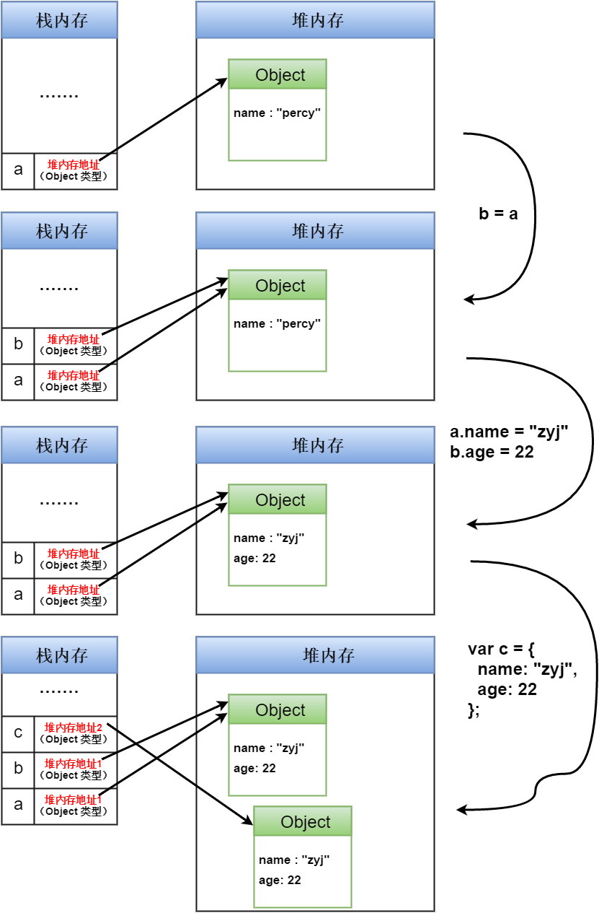
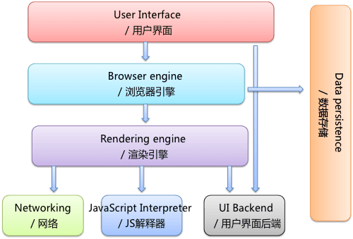

# 基础知识

### 盒模型
1. 每个元素都被表示为一个矩形的盒子，盒子有四个边：

    外边距边（margin）、边框边（border）、内填充边（padding）、内容边（content）。
2. `box-sizing`值：

    >以宽度为例。

    1. `content-box`（默认）

        布局所占宽度 = width + padding左右 + border左右
    2. `border-box`

        布局所占宽度 = width = content + padding左右 + border左右
    3. ~~`padding-box`~~

        （废弃）
3. [margin合并](https://github.com/realgeoffrey/knowledge/blob/master/网站前端/HTML+CSS学习笔记/README.md#margin合并)

>ie低版本盒模型比较特殊。

### JS数据类型
1. 基本数据类型：

    `Undefined`、`Null`、`Boolean`、`Number`、`String`、`Symbol`

    - 存放在栈内存（Stack），按值访问，值的种类有数量上限。

        
2. 引用数据类型：

    `Object`（由`Object`原型链继承的其他所有引用数据类型）

    - 存放在堆内存（Heap），按指针访问，值的种类没有数量上限。

        

### 数据创建方式
1. 对象

    ```javascript
    //对象字面量
    var obj1 = {a: 'b'};

    //构造函数实例化。对象包装器：若参数是null或undefined，将会创建并返回一个空对象；否则，将返回一个与给定值对应类型的对象
    var obj2 = new Object();            //{}
    var obj3 = new Object(1);           //等价于new Number(1)
    var obj4 = new Object(true);        //等价于new Boolean(true)
    var obj5 = new Object('str');       //等价于new String('str')
    var obj6 = new Object({a: 'b'});    //{a: 'b'}

    //普通函数（与new的方式结果一致）
    var obj7 = Object();
    ```
2. 数组

    ```javascript
    //数组字面量
    var arr1 = [2, 3];          //[2, 3]

    //构造函数实例化
    var arr2 = new Array();     //[]
    var arr3 = new Array(2);    //[undefined, undefined]（空位）
    var arr4 = new Array(2, 3); //[2, 3]

    //普通函数（与new的方式结果一致）
    var arr5 = Array();         //[]
    var arr6 = Array(2);        //[undefined, undefined]（空位）
    var arr7 = Array(2, 3);     //[2, 3]
    ```
3. 字符串

    ```javascript
    //字符串字面量
    var str1 = 'string';                //'string'

    //普通函数（与字面量的方式结果一致）
    var str2 = String('string');        //'string'

    //构造函数实例化
    var str3 = new String('string');    //包装对象


    console.log(typeof str1, str1 instanceof String);   //string false
    console.log(typeof str2, str2 instanceof String);   //string false
    console.log(typeof str3, str3 instanceof String);   //object true

    console.log(str1 === str2, str2 === str3);          //true false
    ```

- 其他数据类型，也有字面量方式和构造函数（或普通函数）方式。

### 进制数
1. 二进制表示：

    `0b数值`、`0B数值`
2. 八进制表示：

    `0数值`、`0o数值`、`0O数值`
3. 十六进制表示：

    `0x数值`、`0X数值`

JS内部会自动将八进制、十六进制、二进制转为十进制。

- [不同进制数转换](https://github.com/realgeoffrey/knowledge/blob/master/网站前端/JS方法积累/实用方法/README.md#原生js不同进制数转换)

### 浏览器的主要组件


1. 用户界面

    包括地址栏、前进/后退按钮、书签菜单等。除了浏览器主窗口显示的您请求的页面外，其他显示的各个部分都属于用户界面。
2. 浏览器引擎

    在用户界面和呈现引擎之间传送指令。
3. 渲染引擎

    也称为浏览器内核（web browser engine）、排版引擎（layout engine）或样板引擎，是一种软件组件，负责获取标记式内容（如HTML、XML以及图像文件等）、整理信息（如CSS、XSL），并将排版后的内容输出至显示屏或打印机。

    所有网页浏览器、电子邮件客户端以及其他需要根据表示性的标记语言来显示内容的应用程序，都需要排版引擎。

    >1. IE：Trident。
    >2. Chrome：前WebKit，现Blink。
    >3. Firefox：Gecko。
    >4. Safari：WebKit。
    >5. Opera：前Presto，现Blink。
    >6. Edge：EdgeHTML。
4. 网络

    用于网络调用，如HTTP请求。其接口与平台无关，并为所有平台提供底层实现。
5. 用户界面后端

    用于绘制基本的窗口小部件，如组合框和窗口。其公开了与平台无关的通用接口，而在底层使用操作系统的用户界面方法。
6. JS解释器

    一个专门处理JS脚本的虚拟机，一般会附带在网页浏览器中。

    >1. JScript：ie8-，ASP。
    >2. Chakra：ie9+，Edge。
    >3. V8：Chrome，Opera，Node.js，MongoDB。
    >4. SpiderMonkey：Firefox。
    >5. Nitro：Safari。
7. 数据存储

    这是持久层。浏览器需要在硬盘上保存各种数据，如cookie。HTML5定义了“网络数据库”，这是一个完整（但是轻便）的浏览器内数据库。

### 自动插入分号机制（Automatic Semicolon Insertion，ASI）
1. ASI机制不是说在解析过程中解析器自动把分号添加到代码中，而是说解析器除了分号还会以换行为基础按一定的规则作为断句（EOC）的依据，从而保证解析的正确性。
2. 解析器会尽量将新行并入当前行，当且仅当符合ASI规则时才会将新行视为独立的语句：

    1. `;`空语句
    2. `var`语句
    3. 表达式语句（一定会产生一个值）
    4. `do-while`语句（不是`while`）
    5. `continue`语句
    6. `break`语句
    7. `return`语句
    8. `throw`语句

>前置分号策略：只要判断行首字符为：`[` `(` `+` `-` `/` `` ` ``之一，就在其前面增加分号。

### ECMAScript语法提案的批准流程
一种新的语法从提案到变成正式标准，需要经历五个阶段：

1. Stage 0 - Strawman（展示阶段）
2. Stage 1 - Proposal（征求意见阶段）
3. Stage 2 - Draft（草案阶段）
4. Stage 3 - Candidate（候选人阶段）
5. Stage 4 - Finished（定案阶段）

>一个提案只要能进入Stage 2，就差不多肯定会包括在以后的正式标准（Standard）里面。

### 数据结构（data structure）
计算机中存储、组织数据的方式；意味着接口或封装（一个数据结构可被视为两个函数之间的接口）。

>1. `程序 = 数据结构 + 算法`：数据结构是为解决特定情况下的问题而设计的存储数据方式，算法是操作该数据结构的方法。
>2. 系统架构的关键因素是数据结构而非~~算法~~：选择正确的数据结构可以提高算法的效率；选择最适合的数据结构，决定了程序设计的困难程度与最终成果的质量、表现。

1. 数组（array）

    必须在使用前预先请求固定、连续专用空间，不能再改变（数据溢出问题）。
2. 栈（stack）

    后进先出（LIFO，Last In First Out）：仅允许在顶端进行插入数据、删除数据。
3. 队列（queue）

    先进先出（FIFO，First In First Out）：仅允许在后端进行插入数据，在前端进行删除数据。
4. 链表（linked list）

    一种线性表，但不会按线性的顺序存储数据，而是在每一个节点里存到下一个节点的指针。

    >1. 优点：使用链表结构可以克服数组链表需要预先知道数据大小的缺点，链表结构可以充分利用计算机内存空间，实现灵活的内存动态管理。
    >2. 缺点：链表失去了数组随机读取的优点，同时链表由于增加了结点的指针域，空间开销较大。
5. 树（tree）

    一种抽象数据类型，具有层次关系的集合。

    - 具有以下的特点：

        1. 每个节点有零个或多个子节点。
        2. 没有父节点的节点称为根节点。
        3. 每一个非根节点有且只有一个父节点。
        4. 除了根节点外，每个子节点可以分为多个不相交的子树。
6. 堆（heap）

    1. n个元素序列{k1,k2...ki...kn}，当且仅当满足下列关系时称之为堆：

        `(ki <= k2i,ki <= k2i+1)`或`(ki >= k2i,ki >= k2i+1)`（`(i = 1,2,3,4...n/2)`）。
    2. 堆的实现

        通过构造二叉堆（binary heap，二叉树的一种）：

        1. 任意节点小于（或大于）它的所有后裔，最小元（或最大元）在堆的根上（根节点最大的堆叫做最大堆或大根堆，根节点最小的堆叫做最小堆或小根堆）。
        2. 堆总是一棵完全二叉树（除了最底层，其他层的节点都被元素填满，且最底层尽可能地从左到右填入）。
7. 散列表（hash）

    （也叫哈希表，）根据键（Key）直接访问在内存存储位置。通过计算一个关于键-值的函数（散列函数），将所需查询的数据映射到表（散列表）中一个位置来访问记录，不需比较便可直接取得所查记录。

    >构建哈希表，用空间换时间。
8. 图（graph）

    表示物件与物件之间的关系的方法，由一些小圆点（顶点或结点）和连结这些圆点的线（边）组成。

### 设计模式
一个设计模式是一个可复用的软件解决方案。

1. 单例模式（singleton）

    划分命名空间，减少网页中全局变量的数量。

    使用单体的方法就是用一个命名空间包含自己的所有代码的全局对象。
2. 工厂模式（factory）

    提供一个创建一系列相关或相互依赖对象的接口（方法），而无需指定他们具体的类。

    不用~~new~~的方法调用。
3. 构造函数模式（constructor）

    `new`创建实例，方法中this代表新创建的对象。
4. 观察者模式（observer）

    定义对象间的一种一对多的依赖关系，以便当一个对象的状态发生改变时，所有依赖于它的对象都得到通知并自动刷新。

5. 桥接模式（bridge）

    将抽象与其实现隔离开来，以便二者独立变化。使接口可配置，降低模块间耦合。
6. 装饰着模式（decorator）

    这个模式就是为对象增加功能（或方法）。
7. 组合模式（composite）

    将对象组合成树形结构以表示“部分-整体”的层次结构。它使得客户对单个对象和复合对象的使用具有一致性。
8. 门面模式（facade）

    简化类的接口；消除类与使用它的客户代码之间的耦合。
9. 适配置器模式（adapter）

    将一个类的接口转换成客户希望的另外一个接口。适配器模式使得原本由于接口不兼容而不能一起工作的那些类可以一起工作，使用这种模式的对象又叫包装器，因为他们是在用一个新的接口包装另一个对象。
10. 享元模式（flyweight）

    运用共享技术有效地支持大量细粒度的对象。
11. 代理模式（proxy）

    此模式最基本的形式是对访问进行控制。代理对象和另一个对象（本体）实现的是同样的接口，可是实际上工作还是本体在做，它才是负责执行所分派的任务的那个对象或类，代理对象不会在另以对象的基础上修改任何方法，也不会简化那个对象的接口。
12. 命令模式（command）

    将一个请求封装为一个对象，从而使你可用不同的请求对客户进行参数化；对请求排队或记录请求日志，以及支持可取消的操作。

    命令对象是一个操作和用来调用这个操作的对象的结合体，所有的命名对象都有一个执行操作，其用途就是调用命令对象所绑定的操作。
13. 职责链模式（chain of responsibility）

    为解除请求的发送者和接收者之间耦合，而使多个对象都有机会处理这个请求。将这些对象连成一条链，并沿着这条链传递该请求，直到有一个对象处理它。

    职责链由多个不同类型的对象组成：发送者是发出请求的对象，而接收者则是接收请求并且对其进行处理或传递的对象，请求本身有时也是一个对象，它封装着与操作有关的所有数据。

### 程序设计思路、开发方式、行业术语
1. 平稳退化、渐进增强

    1. 平稳退化（graceful degradation）：

        首先使用最新的技术面向现代浏览器构建最强的功能及用户体验，然后针对低版本浏览器的限制，逐步衰减那些无法被支持的功能及体验。
    2. 渐进增强（progressive enhancement）：

        从最基本的可用性出发，在保证站点页面在低版本浏览器中的可用性和可访问性的基础上，逐步增加功能及提高用户体验。
3. 向前兼容、向后兼容

    1. 向前兼容（forwards compatibility）：

        在将来的场景中还可以兼容使用。
    2. 向后兼容（backwards compatibility）：

        在过去的场景中还可以兼容使用。
4. 自底向上、自顶向下

    1. 自底向上（bottom-up）：

        先编写出基础程序段，然后再逐步扩大规模、补充和升级某些功能。
    2. 自顶向下（top-down）：

        将复杂的大问题分解为相对简单的小问题，找出每个问题的关键、重点所在，然后用精确的思维定性、定量地去描述问题。

5. 编程范式（programming paradigm）：从事软件工程的一类典型的风格，提供并决定了程序员对程序执行的看法。

    1. 面向对象编程、面向过程编程、面向服务的体系结构

        1. 面向对象编程（object oriented programming）：

            把对象作为程序的基本单元，包含数据和操作数据的函数。
        2. 面向过程编程（procedure oriented programming）：

            以一个具体的流程（事务过程）为单位，考虑它的实现。
        3. 面向服务的体系结构（service oriented architecture）
    2. 函数式编程、命令式编程

        1. 函数式编程（functional programming）

            一个程序会被看作是一个无状态的函数计算的序列。更加强调程序执行的结果而非执行的过程，倡导利用若干简单的执行单元让计算结果不断渐进。
        2. 命令式编程（imperative programming）

            关心解决问题的步骤。
6. 直出、同构

    >这里的**渲染**是指：根据JS、CSS文件解析构造DOM达到最终页面效果的过程。

    1. 直出（server-side rendering，服务器端渲染）

        Web后端渲染并输出内容（相对于：客户端AJAX请求数据并渲染DOM）。

        1. WebServer向CGI拉取数据，把数据连同前端文件一起返回，客户端进行页面渲染。

            >客户端不需要请求其他前端文件。
        2. WebServer向CGI拉取数据，在服务器中根据模板渲染，再返回给客户端。

            >客户端不需要请求其他前端文件、客户端不需要运行时渲染。

        >代替客户端耗费性能。
    2. 同构（isomorphic javascript）

        Web前端与Web后端（直出端）使用同一套代码方案（javascript）。

    >- 好处：
    >
    >    1. 更好的搜索引擎优化（SEO）
    >
    >        大部分搜索引擎在爬页面时不支持客户端渲染。
    >    2. 更好的性能
    >
    >        不用或减少浏览器渲染和渲染文件下载，AJAX会增加额外请求等待时间。
    >    3. 更好的维护性
    >
    >        同构使用同一套代码。

    - 构建时预加载

        >多针对无动态数据的页面。

        在前端代码构建时（利用Node.js插件等）就渲染好页面，不需要服务端或客户端渲染。
7. 测试驱动开发、行为驱动开发

    >单元测试（unit testing）：针对程序模块进行正确性检验的测试工作，隔离程序部件并证明这些单个部件是正确的。程序单元是应用的最小可测试部件。在过程化编程中，一个单元就是单个程序、函数、过程等；对于面向对象编程，最小单元就是方法。

    1. 测试驱动开发（Test-driven development，TDD）

        先写测试，后写功能实现。目的是通过测试用例来指引实际的功能开发，让开发人员首先站在全局的视角来看待需求。
    2. 行为驱动开发（Behavior-driven development，BDD）

        要求更多人员参与到软件的开发中来，鼓励开发者、QA、相关业务人员相互协作。由商业价值来驱动，通过用户接口（例如GUI）理解应用程序。
8. 灰度发布、A/B测试

    1. 灰度发布

        对某一产品的发布逐步扩大使用群体范围。
    2. A/B测试

        同时发布多种方案，从几种方案中选择最优方案。
9. JavaScript

    1. 头等函数（first-class function）

        一种编程语言被称为具有头等函数时，语言中的函数将会像任何其他变量一样被对待（例如，函数可以作为参数传递给其他函数、可以作为返回值被返回、可以作为值赋值给变量）。
    2. 原型编程（prototype-based programming）

        它的类（class）没有明确的定义，只是通过向其它的类中添加属性和方法来得到它，甚至偶尔使用空对象来创建类。